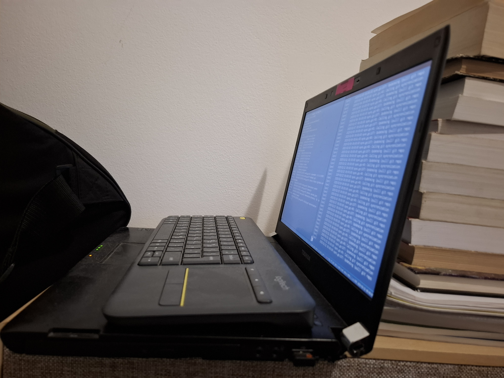

# About This Site

This is a blog site I created as (what hopefully will become) a hobby.  

## Story time

I started with a search for already existing blog servers that I could run on my old laptop, 
but I couldn't find a one that was a fit for me.
There were a lot of `TS` & `node` based ones, which I don't know, nor intend to learn,
and a few `go` based ones, which I do know.
From those, I filtered out ones that implemeted http on their own (quite alot of them).
Because I don't want to create and host a DB/NAS or save the posts only on the server, 
I chose the one that seemed to work with git [this one](https://github.com/shinyypig/git-blog).   
After hours of trying to set it up, figuring out that the git itself is hosted on the web server, 
I decided to give up and create my own...

## The Infrastructure

I decided to host all the blog posts on github to allow for deployment anywere wothout the need to think were was the last place I put them at. And I chose go as the language because I like it, and can also use github for a simple install with `go get` or `go install` (althogh I clone and then build it).  

Cloudflare was an easy choice, because I already bought the domain from them, and the cloudflared tunnel is very convenient for many reasons.

```
|---------------------|       |--------------|
|  old laptop         |       | The Internet |
|                     |       |  (and you)   |
|  |---------------|  |       |------||------|
|  |  docker:8080  |  |              ||
|  |------||-------|  |              ||
|         ||          |              ||
|         ||          |       |------||------|
|  |------||-------|  |       |  cloudflare  |
|  |  cloudflared  <==========|  magic cdn   |
|  |  tunnel       |  |       |--------------|
|  |---------------|  |
|                     |
|---------------------|
```

- a very old laptop runing:
    - OpenSuse Leap 15
    - docker
        - Alpine
        - web server
    - cloudflared

The code for the server is hosted [here](https://github.com/Dolev123/goblog)  
The posts are hosted [here](https://github.com/Dolev123/blog-data)  

Image of the physical computer for funsies:


## using AI

As I am __not__ a frontend developer at all, and have no idea how to make more than the basic html, I tried to find an easy way to make the basic html and css templates.  
At the start I tried to find an open source template I can use, but none of them was to my liking. They either have been to _corporate_ in style, or required some fronted framework. 
So I decided to give __chatGPT__ a try[^1].  
Overall, it was a time saver.  
I didn't need any fancy CSS or a very complex set of pages, and I didn't care to get an average quility UI generation. 
And besides a simple issue with making images to fit within the container, everything went smoothly.  


### FootNotes
[^1]: [The session with chatGPT](https://chatgpt.com/share/67ba4f54-15a0-800c-b71a-bd39a48522fb)
